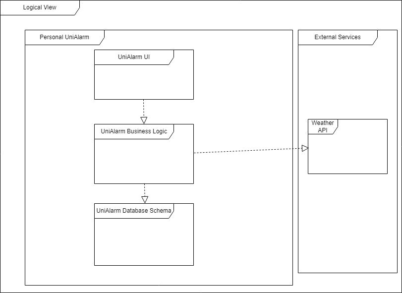
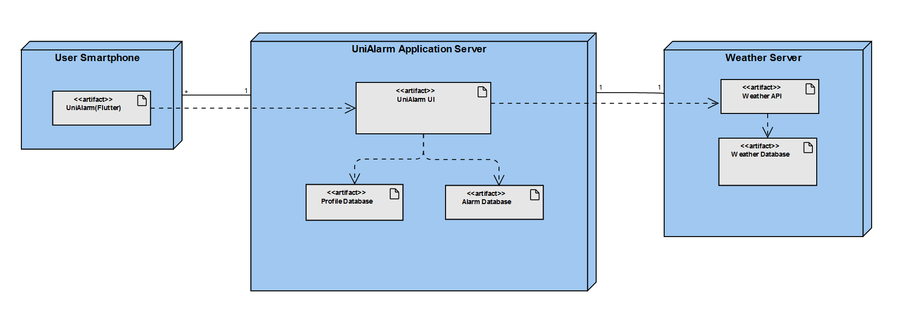

## Architecture and Design

### Logical architecture
Our app’s logical architecture inside the UniAlarm server relies on an UI that communicates with its logic and database, as for external services our app communicates with the weather api that connect to their database in their respective server.

### Physical architecture
Our app, UniAlarm, is developed using the Flutter framework and Dart programming language, and it is designed to run on users' smartphones. The app establishes a connection with the UniAlarm UI, which is hosted on our server. Within the UniAlarm UI, we have integrated access to the profiles database, alarms database, both of which are also hosted on our server. Additionally, we utilize weather APIs hosted on their respective servers to retrieve weather data. The weather API seamlessly connects with its own databases to fetch the required information. This well-structured architecture empowers our app to deliver a smooth and efficient user experience, ensuring fast and reliable access to data from multiple sources.

### Vertical prototype
At this stage, we have implemented several screens of the application, including navigation between the home page, alarms page, and profile page. Additionally, we have successfully integrated the home screen clock to display the current time dynamically, rather than being hardcoded. Finally we 
managed to implement the transition between the alarms page and the normal page and the switch button for theme change.

