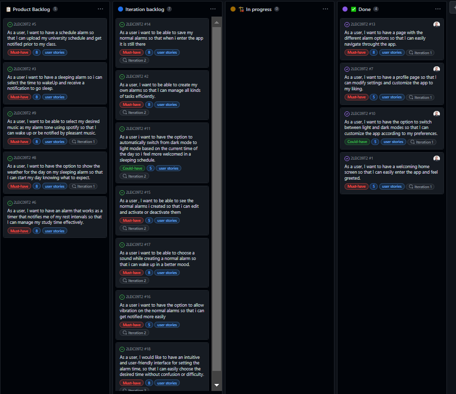

# Project management

## Iteration 0

### Retrospectives  
Overall, we were able to accomplish what we set out to do. However, in retrospect, there are some areas where we could have done better.  
These include:

- Code organization: we could have improved it by using the "extract method" technique more extensively.  
- File organization: we could have separated the code into more files to enhance its organization.  
- Color definitions: we should have separated them for better code maintainability and readability.  
- Mockups: we could have made them more robust and added a dark theme option as well.  
- Acceptance tests: we could have made them more specific to improve their effectiveness.  

### End Board

## Iteration 1

### Retrospectives  

We had high expectations at the start, but we couldn't achieve everything we planned.
Despite that, we've made good progress by fixing issues and updating the design.
For the next update, we want to use Firebase to make the app more flexible and add a functional alarm.
We need to make sure Firebase will work for us before we proceed.

Looking back, we learned that for the next update, we should focus on making the alarms feature more dynamic and responsive to changes, instead of being fixed.

### Start Board

### End Board

## Iteration 2

### Retrospectives

In this iteration, we attempted to split into pairs in order to work more efficiently,
and the approach was fairly successful. We managed to complete nearly all of the tasks
we had programmed. Moving forward, we plan to work more independently, drawing on the experience we have gained thus far.

During this iteration, we were able to utilize Firebase, as we had discussed previously,
and we were successful in creating alarms. However, we encountered an issue with users needing
to be logged in, which we plan to address in the next iteration.

Although we worked well in pairs, we recognize that we could have accomplished
more working independently. Therefore, for the next iteration, we plan to divide the tasks among
the team and collaborate as needed when tasks become too challenging to complete solo.

### Start Board

### End Board

## Iteration 3

### Retrospectives

During this iteration, we made significant progress in enhancing user authentication by implementing register and login features. 
This ensures that users can access their previously created alarms once they log in to the app. 
In addition, users can now delete any alarms they no longer need, adding more flexibility to the app's functionality.

We have also made significant improvements in implementing the main pages for schedule, study, and sleep alarms, although with hardcoded data.

Although notifications are functional, we acknowledge that they are not yet optimized to their full potential. 
Specifically, the current version does not allow users to select the music for their alarms, and there may be slight timing discrepancies. 
Rest assured that we will resolve these issues in the next iteration.

Throughout this iteration, we discovered that we achieved more progress while working independently than in pairs. 
Therefore, for the next iteration, we plan to adopt this approach once again.

### Start Board

### End Board

## Iteration 4

### Retrospectives

We have made significant progress in this iteration by employing the successful strategy used in the previous iteration. We have successfully implemented the functionality of the sleep alarm and schedule alarm, ensuring their full operation. Furthermore, we have made the decision to exclude the Spotify API functionality and instead, we have modified the Weather API to display weather information on the main screen rather than when the alarm goes off.

In conclusion, we take pride in the development of our app as we have accomplished most of the objectives we aimed to cover.

### Start Board

### End Board

