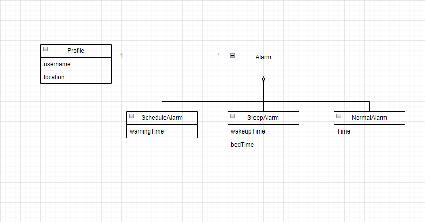

### Domain model

Profile-Using our app, the user will be able to create his own profile, inserting his name, locality and choosing a picture as profile image.

Alarm-The user will be able to set up some different types of alarms, ScheduleAlarm using his university schedule, SleepAlarm where he inputs the time he wants to go to sleep and the time he wants to wake up and a NormalAlarm.

 

  

